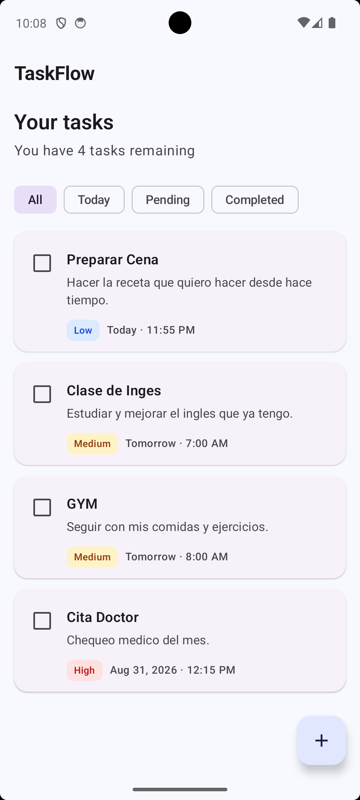
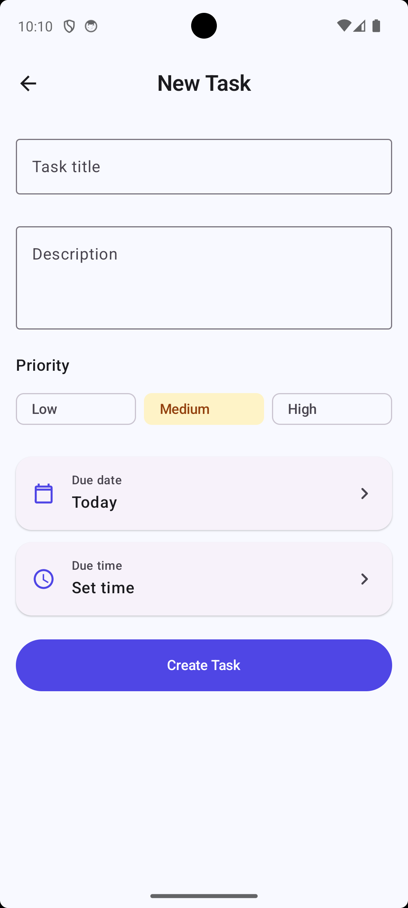
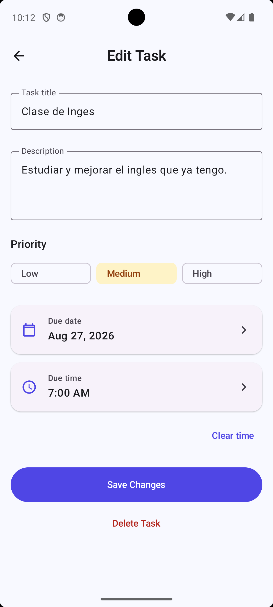
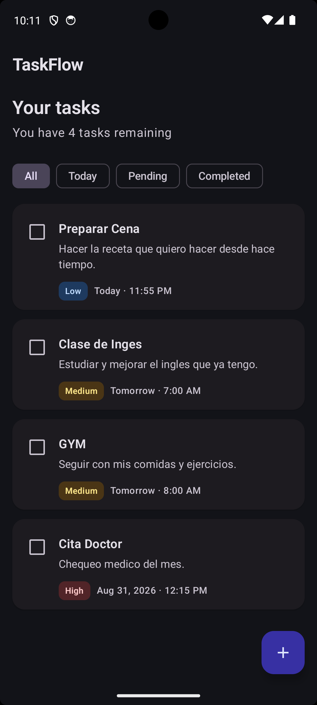

✅ TaskFlow

TaskFlow is a modern Android task management app built with Kotlin and Jetpack Compose.

It was created as a portfolio and learning project to practice a professional Android workflow using modern architecture, reactive state management, local persistence, dependency injection, navigation, testing, and incremental Git-based development.

Local-first, simple by design, and intentionally scoped as a clean MVP.

✨ Features

✅ Create, edit, and delete tasks

☑️ Mark tasks as completed or pending

🚦 Priority levels: Low, Medium, High

📅 Due date

🕒 Optional due time with clear/reset support

🔎 Filters: All, Today, Pending, Completed

🧹 Empty states for an empty database and empty filters

🌙 Light and Dark Theme

💾 Persistent local storage with Room

⚠️ Validation and basic persistence error handling

🗑️ Delete confirmation dialog

🔄 Reactive UI updates through Flow / StateFlow

## 📷 Screenshots

| Home | New Task |
| --- | --- |
|  |  |

| Edit Task | Dark Mode |
| --- | --- |
|  |  |
🛠️ Tech Stack

Kotlin

Jetpack Compose

Material 3

MVVM

Coroutines

Flow / StateFlow

Navigation Compose

Room

Hilt

KSP

JUnit

Android Instrumented Tests

Compose UI Testing

🧱 Architecture

TaskFlow uses an architecture proportional to the size of the app:

Compose UI
    ↓
ViewModel
    ↓
Repository
    ↓
Room DAO
    ↓
Room Database

Room is the local source of truth.

The UI observes immutable StateFlow exposed by the ViewModels.

Database changes are propagated through Room Flow, so Compose updates reactively after create, update, delete, or completion changes.

Why no Domain Layer or Use Cases?

TaskFlow is intentionally small.

Adding extra architectural layers would add ceremony without solving a real problem.

The current structure keeps the project:

easy to understand

testable

maintainable

appropriate for the scope of the MVP

📁 Project Structure

com.eduardogomez.taskflow
│
├── data
│   ├── local
│   │   ├── TaskDao
│   │   ├── TaskDatabase
│   │   ├── TaskEntity
│   │   ├── TaskPriority
│   │   └── TaskConverters
│   │
│   └── repository
│       ├── TaskRepository
│       └── DefaultTaskRepository
│
├── di
│   ├── DatabaseModule
│   └── RepositoryModule
│
├── feature
│   ├── home
│   │   ├── HomeScreen
│   │   ├── HomeUiState
│   │   ├── HomeViewModel
│   │   └── TaskCard
│   │
│   └── taskeditor
│       ├── TaskEditorScreen
│       ├── TaskEditorUiState
│       └── TaskEditorViewModel
│
├── navigation
│   ├── TaskFlowDestination
│   └── TaskFlowNavHost
│
└── ui
    └── theme

🔄 Reactive Data Flow

One of the main goals of TaskFlow was to implement a real reactive Android data flow.

Room
  ↓ Flow<List<TaskEntity>>
TaskRepository
  ↓
ViewModel
  ↓ StateFlow<UiState>
Compose
  ↓
Recomposition

For example, after a task is created:

TaskEditorViewModel calls the repository.

The repository delegates to TaskDao.

Room inserts the task in SQLite.

Room invalidates the observed query.

The Flow emits a new list.

HomeViewModel creates a new HomeUiState.

Compose receives the new state and recomposes automatically.

No manual refresh of Home is required.

💉 Dependency Injection

TaskFlow uses Hilt to create and connect dependencies.

TaskDatabase
    ↓
TaskDao
    ↓
DefaultTaskRepository
    ↓
HomeViewModel / TaskEditorViewModel

Key decisions:

@Provides is used for Room objects that Hilt cannot construct directly.

@Binds connects TaskRepository with DefaultTaskRepository.

TaskDatabase is scoped as a singleton.

ViewModels use constructor injection.

Navigation is kept outside the ViewModels.

🧭 Create & Edit Flow

The same Task Editor is reused for both modes.

Create
Home → FAB → TaskEditor → insertTask()

Edit
Home → TaskCard(taskId) → TaskEditor → updateTask()

SavedStateHandle receives the navigation argument and allows TaskEditorViewModel to determine whether the screen is operating in Create or Edit mode.

When editing, the original:

id

createdAtEpochMillis

isCompleted

values are preserved.

📅 Date & Time Modeling

TaskFlow avoids storing formatted UI strings in the database.

Due date → dueDateEpochDay

Due time → dueTimeMinutes

This keeps persistence independent from presentation formatting.

A due time is optional and can return to null through the Clear time action.

🧪 Testing

TaskFlow uses different testing levels for different responsibilities.

Unit Tests

ViewModel logic is tested using fake repositories.

Examples include:

filtering

pending count

validation

create

edit

delete

error handling

invalid task IDs

date/time validation

duplicate-operation protection

Room Tests

DAO behavior is tested using an in-memory Room database.

Examples include:

insert

query

update

delete

completion changes

deterministic ordering

Compose / Navigation Integration Tests

Integration tests cover real connections between:

Compose

Navigation

Hilt

Room

Current automated suite:

41 unit tests

8 instrumented tests

0 test failures

0 lint errors

⚙️ Requirements

Android Studio

JDK 21

Minimum Android version: API 26

Android SDK compatible with the project's configured compileSdk

🚀 Getting Started

1. Clone the repository

git clone https://github.com/IngDanielAceves/TaskFlow.git
cd TaskFlow

2. Open the project

Open the project in Android Studio and allow Gradle to sync.

3. Build

./gradlew assembleDebug

4. Run unit tests

./gradlew testDebugUnitTest

5. Run lint

./gradlew lintDebug

6. Run instrumented tests

An Android emulator or physical device is required:

./gradlew connectedDebugAndroidTest

🔐 Repository Hygiene

The repository intentionally excludes local or sensitive development files such as:

.idea/

.kotlin/

local.properties

Gradle/build caches

*.jks

*.keystore

Room schema files and the Gradle Wrapper remain tracked intentionally for reproducibility and future database migration support.

No API keys, passwords, tokens, or private credentials are required by TaskFlow.

📌 Project Status

TaskFlow MVP is complete.

The current scope intentionally focuses on solid Android fundamentals rather than feature volume.

Potential future improvements could include:

backend synchronization

Room migrations for future schema versions

process-death restoration for unsaved drafts

paging or indexed queries if the task volume grows

CI checks with GitHub Actions

These are intentionally outside the current MVP.

🎯 What This Project Demonstrates

TaskFlow demonstrates practical understanding of:

modern Android UI with Compose

unidirectional data flow

lifecycle-aware state collection

reactive persistence

ViewModel state ownership

dependency injection

navigation arguments

local database design

coroutine cancellation

error handling

testing at multiple layers

incremental Git-based development

📄 License

This project is intended for educational and professional portfolio purposes.

A formal license can be added depending on the intended reuse policy.

👨‍💻 Author

Eduardo Gómez

Android Developer · Kotlin · Jetpack Compose

Built as a hands-on Android engineering project.